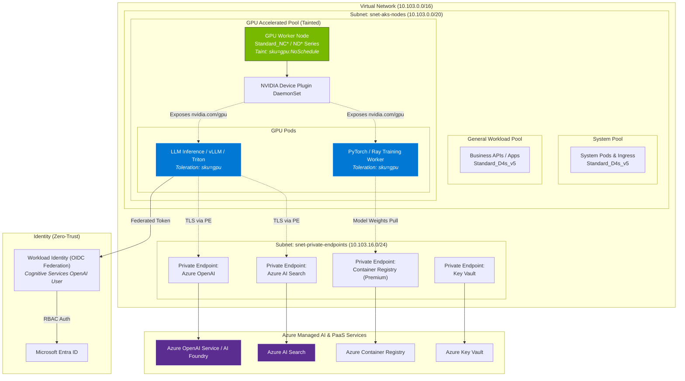

# AI Infrastructure as a Service on AKS

## Overview

This guide details the architecture, configuration, security governance, and deployment practices for running intensive Artificial Intelligence (AI) and Machine Learning (ML) workloads on the enterprise AKS platform.

The platform provides **AI Infrastructure as a Service (AI IaaS)**, combining:
1. **GPU-Accelerated Compute Pools** (NVIDIA Tensor Core GPUs) for deep learning training, fine-tuning, and low-latency Large Language Model (LLM) inference.
2. **Dedicated Scheduling & Isolation** using Kubernetes taints, tolerations, and node affinity to prevent co-mingling with standard CPU workloads.
3. **Zero-Trust Security & Identity Integration** via AKS Workload Identity to authenticate securely against Azure AI services (Azure OpenAI, Azure AI Search, Azure AI Foundry) without managing long-lived API keys or credentials.
4. **Private Network Boundaries** routing all traffic over private endpoints and internal subnets.

---

## Architecture Diagram



---

## GPU Node Pool VM Sizing & Families

Azure provides several NVIDIA GPU-accelerated VM series designed for different stages of the AI lifecycle:

| VM Family | GPU Model | Typical AI/ML Use Case | Recommended OS SKU | Autoscaling Strategy |
|-----------|-----------|------------------------|--------------------|----------------------|
| **Standard_NCas_T4_v3** | NVIDIA Tesla T4 (16 GB) | Cost-effective LLM inference, computer vision, audio processing | `Ubuntu` | Scale from `min_count = 0` to max |
| **Standard_NCsv3** | NVIDIA Tesla V100 (16/32 GB) | Mid-scale model fine-tuning, embeddings generation | `Ubuntu` | Scale from `min_count = 0` to max |
| **Standard_NC_A100_v4** | NVIDIA A100 PCIe (40/80 GB) | Large model fine-tuning, batch distributed training | `Ubuntu` | Reserved or burst scale from 0 |
| **Standard_ND_H100_v5** | NVIDIA H100 SXM5 (80 GB) | Frontier LLM pre-training, ultra-low latency distributed inferencing | `Ubuntu` | Clustered placement groups |

> [!NOTE]
> For NVIDIA GPU acceleration, AKS automatically mounts specialized kernel drivers when deploying NVIDIA GPU series VMs. `Ubuntu` is the recommended and primary tested OS SKU for CUDA driver and kernel module stability on `Standard_NC*` and `Standard_ND*` series.

---

## Terraform Provisioning

To provision a GPU-enabled node pool with the `modules/aks` module, specify the pool within the `node_pools` map in your environment configuration (`environments/prod/main.tf`):

```hcl
module "aks" {
  source = "../../modules/aks"

  cluster_name        = local.aks_cluster_name
  resource_group_name = azurerm_resource_group.this.name
  resource_group_id   = azurerm_resource_group.this.id
  location            = azurerm_resource_group.this.location
  vnet_subnet_id      = module.networking.subnet_ids["snet-aks-nodes"]

  # Default system pool runs critical addons and core services
  default_node_pool = {
    name                         = "system"
    vm_size                      = "Standard_D4s_v5"
    min_count                    = 2
    max_count                    = 5
    auto_scaling_enabled         = true
    os_sku                       = "AzureLinux"
    only_critical_addons_enabled = true
    zones                        = ["1"]
  }

  node_pools = {
    # General workload pool for microservices
    "workload" = {
      vm_size              = "Standard_D4s_v5"
      min_count            = 1
      max_count            = 5
      auto_scaling_enabled = true
      os_sku               = "AzureLinux"
      zones                = ["1"]
      node_labels          = { "workload-type" = "general" }
    }

    # GPU-enabled pool for AI inferencing & training
    "gpu" = {
      vm_size              = "Standard_NC4as_T4_v3"
      min_count            = 0   # Scale to zero when idle to minimize cloud spend
      max_count            = 4
      auto_scaling_enabled = true
      os_sku               = "Ubuntu"
      zones                = ["1"]
      os_disk_size_gb      = 256 # Higher disk size for container images & model cache
      os_disk_type         = "Managed"

      node_labels = {
        "workload-type" = "gpu"
        "accelerator"   = "nvidia"
      }

      # Strict taint prevents standard applications from landing on costly GPU nodes
      node_taints = [
        "sku=gpu:NoSchedule"
      ]
    }
  }

  # Monitoring & governance
  log_analytics_workspace_id = module.log_analytics.workspace_id
  oidc_issuer_enabled       = true
  workload_identity_enabled = true
}
```

---

## Workload Isolation & Scheduling

### Node Taints and Tolerations

To ensure expensive GPU compute nodes are reserved exclusively for GPU-dependent containers:
1. **Taint on Node Pool**: `sku=gpu:NoSchedule`
2. **Toleration on AI Pods**:
   ```yaml
   tolerations:
   - key: "sku"
     operator: "Equal"
     value: "gpu"
     effect: "NoSchedule"
   ```
3. **Node Selector / Node Affinity**:
   ```yaml
   nodeSelector:
     workload-type: "gpu"
     accelerator: "nvidia"
   ```

### Requesting GPU Resources

To inform Kubernetes and the NVIDIA device plugin that a pod requires hardware GPU access, specify `resources.limits` with `nvidia.com/gpu`:

```yaml
resources:
  requests:
    cpu: "2"
    memory: "8Gi"
    nvidia.com/gpu: "1"
  limits:
    cpu: "4"
    memory: "16Gi"
    nvidia.com/gpu: "1"
```

---

## Secure Azure AI Services Integration

In a modern enterprise architecture, AI models hosted on AKS frequently consume cloud AI capabilities (such as Azure OpenAI for GPT-4o embeddings/chat or Azure AI Search for enterprise RAG pipelines).

### 1. Zero-Trust Access with Workload Identity (No API Keys)

Storing Azure OpenAI API keys inside Kubernetes Secrets or config maps violates enterprise compliance. The platform mandates **Azure AD Workload Identity**:

1. A Kubernetes `ServiceAccount` is annotated with the Azure Managed Identity Client ID:
   ```yaml
   apiVersion: v1
   kind: ServiceAccount
   metadata:
     name: ai-workload-sa
     namespace: ai-apps
     annotations:
       azure.workload.identity/client-id: "<MANAGED_IDENTITY_CLIENT_ID>"
   ```

2. The Azure Managed Identity has a **Federated Identity Credential** linked to the AKS cluster OIDC issuer URL (`module.aks.oidc_issuer_url`):
   - **Issuer**: `https://<region>.oic.prod-aks.azure.com/<guid>/`
   - **Subject**: `system:serviceaccount:ai-apps:ai-workload-sa`
   - **Audience**: `api://AzureADTokenExchange`

3. The Managed Identity is granted the appropriate RBAC role on Azure OpenAI:
   - **Role**: `Cognitive Services OpenAI User`
   - **Scope**: `/subscriptions/.../resourceGroups/.../providers/Microsoft.CognitiveServices/accounts/<openai-account-name>`

4. SDK code uses standard `DefaultAzureCredential()` without any static API keys:
   ```python
   from azure.identity import DefaultAzureCredential
   from openai import AzureOpenAI

   client = AzureOpenAI(
       azure_endpoint="https://aoai-corp-prod.openai.azure.com/",
       azure_ad_token_provider=DefaultAzureCredential().get_token_provider(
           "https://cognitiveservices.azure.com/.default"
       ),
       api_version="2024-06-01"
   )
   ```

### 2. Private Networking & Data Exfiltration Protection

- **Private Endpoints**: Azure OpenAI and Azure AI Search endpoints must be connected to `snet-private-endpoints`.
- **Private DNS**: Private DNS zone `privatelink.openai.azure.com` resolves endpoints internally.
- **Firewall & NSG Boundaries**: Outbound calls from AKS worker nodes to external public endpoints can be blocked or routed through the Hub Azure Firewall. All AI interactions occur strictly within the VNet perimeter.

---

## Production Deployment Manifest Example

Below is a complete Kubernetes deployment showing GPU scheduling, resource limits, and Workload Identity integration:

```yaml
apiVersion: apps/v1
kind: Deployment
metadata:
  name: rag-llm-inference
  namespace: ai-apps
  labels:
    app: rag-llm-inference
spec:
  replicas: 1
  selector:
    matchLabels:
      app: rag-llm-inference
  template:
    metadata:
      labels:
        app: rag-llm-inference
        azure.workload.identity/use: "true"
    spec:
      serviceAccountName: ai-workload-sa
      # Target GPU node pool
      nodeSelector:
        workload-type: "gpu"
        accelerator: "nvidia"
      # Tolerate GPU taint
      tolerations:
      - key: "sku"
        operator: "Equal"
        value: "gpu"
        effect: "NoSchedule"
      containers:
      - name: inference-engine
        image: acrcorpprod.azurecr.io/ai/embedding-worker:v1.2.0
        env:
        - name: AZURE_OPENAI_ENDPOINT
          value: "https://aoai-corp-prod.openai.azure.com/"
        - name: AZURE_CLIENT_ID
          value: "00000000-0000-0000-0000-000000000000"
        resources:
          requests:
            cpu: "4"
            memory: "16Gi"
            nvidia.com/gpu: "1"
          limits:
            cpu: "8"
            memory: "32Gi"
            nvidia.com/gpu: "1"
        securityContext:
          allowPrivilegeEscalation: false
          readOnlyRootFilesystem: true
          runAsNonRoot: true
          runAsUser: 10001
          capabilities:
            drop:
            - ALL
```

---

## Observability, Cost Control & Best Practices

1. **Scale from Zero**: GPU instances have high hourly operational costs. Configure `min_count = 0` on GPU node pools so nodes are only provisioned when pending pods with matching tolerations and requests are submitted.
2. **NVIDIA DCGM Exporter**: Deploy the NVIDIA Data Center GPU Manager (DCGM) exporter to collect GPU temperature, memory utilization, streaming multiprocessor (SM) clock speeds, and PCIe throughput into Azure Monitor / Prometheus.
3. **Model Weight Caching**: For large models (e.g. >10 GB), avoid re-downloading model weights on every pod restart. Use persistent volumes backed by Premium SSD v2 or Azure Blob CSI driver (`blob.csi.azure.com`) with local node read-through caching.
4. **Driver Auto-Remediation**: Use the AKS node auto-repair features and Container Insights alerts to detect GPU driver failures or Xid errors.
