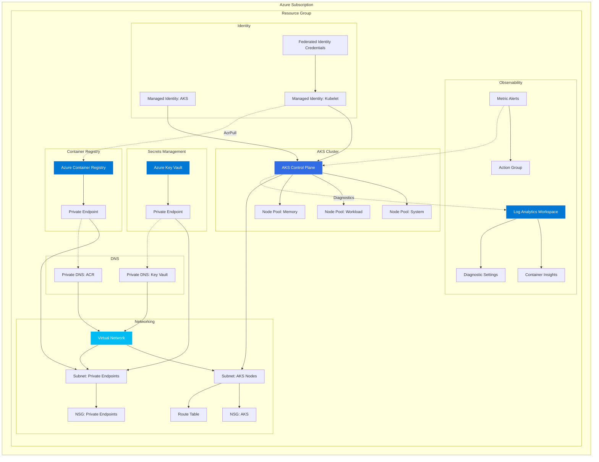
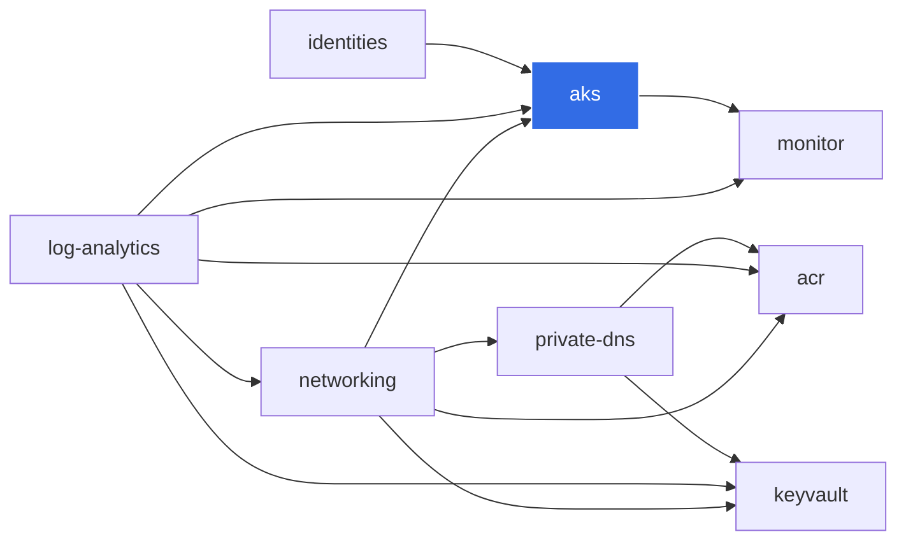

# Platform Architecture

## Overview

The AKS Platform Starter provides a modular, enterprise-grade foundation for deploying Azure Kubernetes Service clusters with all supporting infrastructure.

## Architecture Diagram

## Component Interaction

### Data Flow

1. **Identity** → AKS: User-assigned managed identity is attached to the AKS cluster at creation
2. **Kubelet Identity** → ACR: The kubelet identity is granted `AcrPull` to pull container images
3. **AKS** → VNet: Nodes are deployed into a dedicated subnet with NSG and route table
4. **AKS** → Log Analytics: Container Insights agent forwards logs and metrics
5. **Private Endpoints** → DNS: Private DNS zones resolve service FQDNs to private IPs
6. **Monitor** → AKS: Diagnostic settings capture control plane logs; metric alerts fire on threshold

### Module Dependencies

## Networking Architecture

The platform uses a hub-and-spoke-ready design:

| Subnet | Purpose | Default CIDR |
|--------|---------|--------------|
| `snet-aks-nodes` | AKS node pool VMs | `/20` (4,094 IPs) |
| `snet-private-endpoints` | Private endpoints for PaaS services | `/24` (254 IPs) |
| `snet-appgw` | Application Gateway (prod only) | `/24` (254 IPs) |

### CNI Overlay

Azure CNI Overlay is used for pod networking:

- **Node IPs** come from the VNet subnet
- **Pod IPs** come from a separate overlay CIDR (`10.244.0.0/16` by default)
- This avoids IP exhaustion in the VNet and simplifies subnet sizing

## Security Model

See [security.md](security.md) for the full security architecture.

### Key Principles

1. **No public API server** in production (private cluster)
2. **No admin user** on ACR (managed identity only)
3. **RBAC authorization** for Key Vault (not access policies)
4. **Azure RBAC** for Kubernetes (unified identity plane)
5. **Workload Identity** for pod-level Azure AD authentication
6. **NSG deny-all** with explicit allow rules
7. **Private endpoints** for all PaaS services in production
