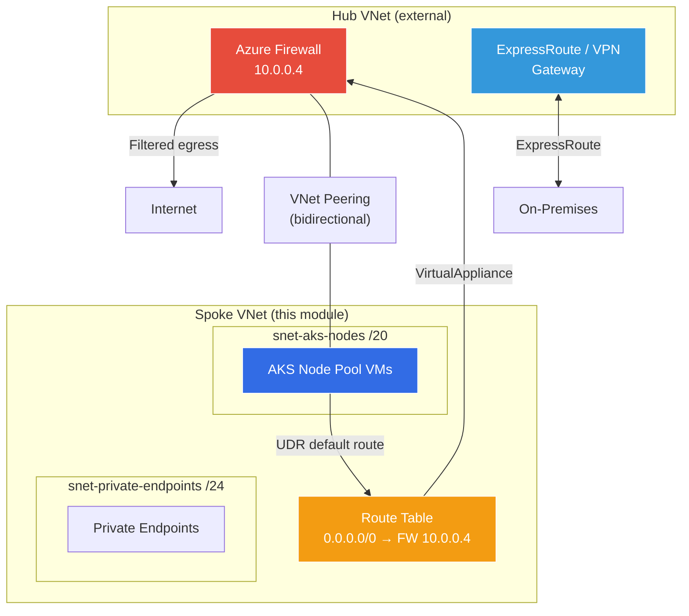

# Networking Architecture

## Virtual Network Design

The platform deploys a single Virtual Network per environment with dedicated subnets for isolation:

```
┌─────────────────────────────────────────────┐
│ Virtual Network (e.g., 10.100.0.0/16)       │
│                                             │
│  ┌──────────────────────────┐               │
│  │ snet-aks-nodes /20       │  4,094 IPs    │
│  │ AKS node pool VMs        │               │
│  └──────────────────────────┘               │
│                                             │
│  ┌──────────────────────────┐               │
│  │ snet-private-endpoints   │  254 IPs      │
│  │ /24                      │               │
│  └──────────────────────────┘               │
│                                             │
│  ┌──────────────────────────┐               │
│  │ snet-appgw /24 (prod)    │  254 IPs      │
│  └──────────────────────────┘               │
└─────────────────────────────────────────────┘
```

## IP Address Allocation Strategy

| Environment | VNet CIDR | AKS Nodes | Private Endpoints |
|-------------|-----------|-----------|-------------------|
| dev         | 10.100.0.0/16 | 10.100.0.0/20 | 10.100.16.0/24 |
| test        | 10.101.0.0/16 | 10.101.0.0/20 | 10.101.16.0/24 |
| preprod     | 10.102.0.0/16 | 10.102.0.0/20 | 10.102.16.0/24 |
| prod        | 10.103.0.0/16 | 10.103.0.0/20 | 10.103.16.0/24 |

Non-overlapping CIDRs allow VNet peering between environments if needed.

## Azure CNI Overlay

The platform uses **Azure CNI Overlay** for pod networking:

- **Benefit**: Pod IPs are drawn from a separate overlay address space (`10.244.0.0/16`), not from the VNet
- **Result**: You only need to size subnets for *nodes*, not for pods
- **Max pods per node**: 110 (configurable)

### Why Not Azure CNI (Traditional)?

Traditional Azure CNI pre-allocates pod IPs from the VNet subnet, which leads to:
- Subnet exhaustion at scale (250 nodes × 110 pods = 27,500 IPs)
- Wasteful IP reservation
- Complex CIDR planning

CNI Overlay avoids all of these issues.

## Network Security Groups

### Strategy

- **Default deny** all inbound traffic in preprod/prod
- **Explicit allow** only required traffic
- **Service tags** used where possible (e.g., `AzureLoadBalancer`, `VirtualNetwork`)

### Default Rules (Production)

| Priority | Name | Direction | Action | Source | Destination | Port |
|----------|------|-----------|--------|--------|-------------|------|
| 100 | AllowHTTPSFromVnet | Inbound | Allow | VirtualNetwork | VirtualNetwork | 443 |
| 110 | AllowAzureLB | Inbound | Allow | AzureLoadBalancer | * | * |
| 4096 | DenyAllInbound | Inbound | Deny | * | * | * |

## Route Tables

Route tables are optional and can be used for:

- **User-Defined Routes (UDR)** to force traffic through a firewall (Azure Firewall, NVA)
- **BGP route propagation** control for ExpressRoute/VPN scenarios

## Private Endpoints

In production environments, all PaaS services are accessed via private endpoints:

| Service | Private DNS Zone | Subnet |
|---------|-----------------|--------|
| ACR | privatelink.azurecr.io | snet-private-endpoints |
| Key Vault | privatelink.vaultcore.azure.net | snet-private-endpoints |
| AKS API Server | privatelink.<region>.azmk8s.io | snet-aks-nodes |

### DNS Resolution

Private DNS zones are linked to the VNet, ensuring that:
1. `myacr.azurecr.io` resolves to a private IP within the VNet
2. The AKS API server (`*.privatelink.<region>.azmk8s.io`) resolves natively for nodes and VNet clients
3. No traffic leaves the Azure backbone
4. NSG rules on the subnets control access

## Hub & Spoke Integration

The networking module supports **optional** integration with an enterprise Hub VNet in a Hub & Spoke topology. When enabled, it provisions VNet peering and User Defined Routes (UDR) for egress through the Hub's Azure Firewall.

### Architecture



### How It Works

1. **VNet Peering (bidirectional)**:
   - **Spoke → Hub**: `allow_forwarded_traffic = true`, optionally `use_remote_gateways = true` for ExpressRoute/VPN
   - **Hub → Spoke**: `allow_forwarded_traffic = true`, optionally `allow_gateway_transit = true`
   - Supports **same-subscription** and **cross-subscription** peering via `hub_subscription_id`

2. **Egress UDR to Azure Firewall**:
   - A dedicated route table is created with a default route `0.0.0.0/0` → Azure Firewall private IP
   - `bgp_route_propagation_enabled = false` (required for UDR with Azure Firewall)
   - Associated with AKS node subnets (configurable via `hub_egress_subnet_keys`)
   - Additional custom routes can be added via `hub_additional_routes`

3. **DNS Forwarding**:
   - Use the `dns_servers` variable to point the VNet to the Hub's DNS forwarder
   - Enables resolution of Private DNS Zones hosted in the Hub

### Hub Variables

| Variable | Type | Default | Description |
|----------|------|---------|-------------|
| `hub_vnet_id` | `string` | `null` | Resource ID of the Hub VNet. Enables peering when set. |
| `hub_vnet_name` | `string` | `null` | Name of the Hub VNet (required when peering is enabled). |
| `hub_vnet_resource_group_name` | `string` | `null` | Resource group of the Hub VNet (required when peering is enabled). |
| `hub_subscription_id` | `string` | `null` | Subscription ID of the Hub VNet for cross-subscription peering. |
| `hub_use_remote_gateways` | `bool` | `false` | Use the Hub's gateways (ExpressRoute/VPN). |
| `hub_allow_gateway_transit` | `bool` | `false` | Allow the Hub to transit its gateways to the Spoke. |
| `hub_firewall_private_ip` | `string` | `null` | Private IP of the Hub's Azure Firewall. Enables egress UDR. |
| `hub_egress_subnet_keys` | `list(string)` | `["snet-aks-nodes"]` | Subnet keys to associate with the egress route table. |
| `hub_additional_routes` | `list(object)` | `[]` | Additional routes for the egress route table. |

### Example Configuration

```hcl
# terraform.tfvars — Hub & Spoke enabled
hub_vnet_id                  = "/subscriptions/HUB-SUB-ID/resourceGroups/rg-hub-networking/providers/Microsoft.Network/virtualNetworks/vnet-hub"
hub_vnet_name                = "vnet-hub"
hub_vnet_resource_group_name = "rg-hub-networking"
hub_subscription_id          = "HUB-SUB-ID"          # Only if Hub is in a different subscription
hub_firewall_private_ip      = "10.0.0.4"
```

### Azure Firewall Prerequisites (Hub Side)

For AKS to function correctly behind an Azure Firewall, the following network/application rules must be configured on the Hub's Azure Firewall:

| Rule | Type | Source | Destination | Port/Protocol |
|------|------|--------|-------------|---------------|
| AKS API Server | Network | AKS subnet CIDR | `AzureCloud.<region>` | TCP/443 |
| MCR | Application | AKS subnet CIDR | `mcr.microsoft.com`, `*.data.mcr.microsoft.com` | HTTPS/443 |
| Azure Management | Application | AKS subnet CIDR | `management.azure.com` | HTTPS/443 |
| AAD | Application | AKS subnet CIDR | `login.microsoftonline.com` | HTTPS/443 |
| Ubuntu/AzureLinux Updates | Application | AKS subnet CIDR | `packages.microsoft.com`, `security.ubuntu.com` | HTTPS/443 |
| Azure Monitor | Application | AKS subnet CIDR | `*.ods.opinsights.azure.com`, `*.oms.opinsights.azure.com` | HTTPS/443 |
| NTP | Network | AKS subnet CIDR | `ntp.ubuntu.com` | UDP/123 |

> Refer to [Microsoft's official documentation](https://learn.microsoft.com/en-us/azure/aks/outbound-rules-control-egress) for the complete list.

### Standalone Deployments (default behavior)

When no `hub_*` variables are set, the module behaves exactly as before:
- No VNet peering is created
- No Hub egress route table is created
- All existing functionality is preserved (NSGs, route tables, diagnostics)
## DDoS Protection & Diagnostics

For internet-facing, production workloads (e.g., exposing an Application Gateway), the networking module supports:
- **DDoS Protection Plan**: A native Azure DDoS plan can be attached to the Virtual Network to mitigate volumetric attacks.
- **VNet Diagnostics**: Native Virtual Network metrics and `VMProtectionAlerts` are exported to Log Analytics for centralized observability.
