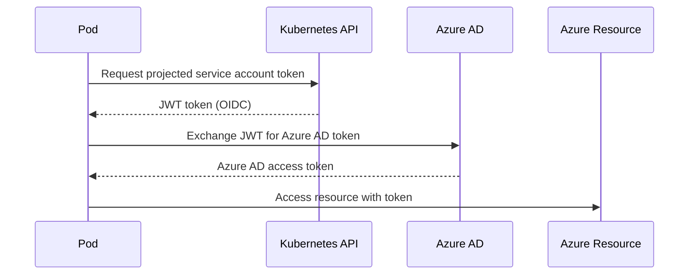

# Security Architecture

## Identity Model

### Cluster Identity

The AKS cluster uses a **User-Assigned Managed Identity** rather than a System-Assigned one:

- **Lifecycle decoupling**: The identity persists independently of the cluster
- **Pre-provisioned RBAC**: Roles can be assigned before the cluster exists
- **Multi-cluster reuse**: The same identity can be shared if needed (though not recommended for isolation)

### Kubelet Identity

A separate managed identity is used for the kubelet (node) operations:

- Pulls images from ACR via `AcrPull` role
- Isolated from the control plane identity
- Follows least privilege — only the permissions needed for node operations

### Workload Identity

Pod-level Azure AD authentication is enabled via:

1. **OIDC issuer** on the AKS cluster
2. **Federated Identity Credentials** mapping Kubernetes service accounts to Azure AD identities
3. No secrets stored in pods — tokens are exchanged via the OIDC flow

## RBAC Model

### Kubernetes Authorization

The platform uses **Azure RBAC for Kubernetes**, not the Kubernetes-native RBAC:

| Benefit | Description |
|---------|-------------|
| Unified identity | Same Azure AD groups control both Azure and Kubernetes access |
| Centralized audit | All access logged in Azure AD sign-in logs |
| Conditional Access | MFA, device compliance, location policies apply |
| No kubeconfig secrets | Users authenticate via `az aks get-credentials` |

### Local Account Disabled

The local Kubernetes admin account (`clusterAdmin`) is **disabled** by default:

- Prevents bypass of Azure AD authentication
- Enforces MFA and Conditional Access
- All access is auditable

### Recommended Role Assignments

| Role | Scope | Purpose |
|------|-------|---------|
| Azure Kubernetes Service RBAC Cluster Admin | Cluster | Full cluster admin |
| Azure Kubernetes Service RBAC Admin | Namespace | Namespace-level admin |
| Azure Kubernetes Service RBAC Writer | Namespace | Deploy workloads |
| Azure Kubernetes Service RBAC Reader | Cluster | Read-only access |

## Secrets Management

### Key Vault Integration

- **RBAC authorization** (not access policies) for granular, auditable access
- **Soft delete + purge protection** prevent accidental or malicious deletion
- **Private endpoint** in production — no public access
- **Diagnostic logging** of all audit events to Log Analytics

### Secret Access Pattern

Applications access Key Vault secrets via:

1. **Workload Identity** (recommended) — pod uses federated credentials to get Azure AD token
2. **CSI Secret Store Driver** (optional add-on) — mounts secrets as volumes

## Network Security

### Defense in Depth

| Layer | Control | Environment |
|-------|---------|-------------|
| Perimeter | Private cluster (no public API) | preprod, prod |
| Network | NSG deny-all with explicit allows | preprod, prod |
| Service | Private endpoints for PaaS | preprod, prod |
| Transport | TLS everywhere | all |
| Identity | Azure AD + MFA | all |
| Data | Key Vault for secrets | all |
| Monitoring | Audit logs + alerts | all |

### Private Cluster

In production:
- The AKS API server has **no public IP**
- Access is via private endpoint within the VNet
- Use `az aks command invoke` or a jumpbox for management

## Least Privilege

The platform follows least privilege at every layer:

1. **AKS identity**: Only `Contributor` on its resource group
2. **Kubelet identity**: Only `AcrPull` on the Container Registry
3. **Workload identities**: Scoped to specific resources (Key Vault secrets, Storage, etc.)
4. **Network**: Default deny with explicit allows
5. **Key Vault**: RBAC roles scoped to specific secrets/keys

## Compliance Considerations

The security architecture supports compliance with:

- **SOC 2**: Audit logging, access controls, encryption
- **ISO 27001**: Information security management
- **PCI DSS**: Network segmentation, encryption, access control
- **GDPR**: Data residency (single-region), audit trails

> **Note**: Additional controls (Azure Policy, Defender for Cloud) are on the roadmap.
