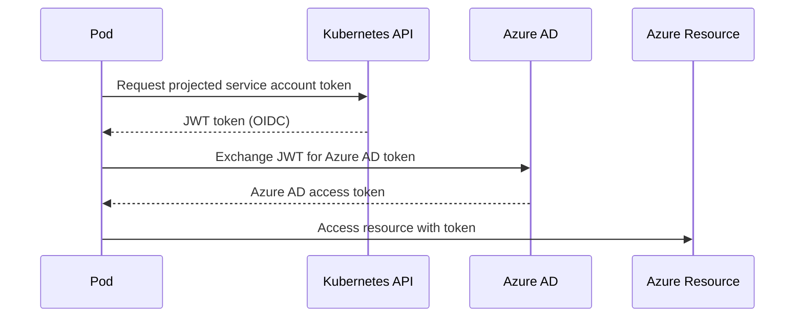

# Security Architecture

## Identity Model

### Cluster Identity (Control Plane)

The AKS cluster uses a **User-Assigned Managed Identity** rather than a System-Assigned one:

- **Lifecycle decoupling**: The identity persists independently of the cluster.
- **Pre-provisioned RBAC**: Roles can be assigned before the cluster exists, preventing deployment race conditions.
- **Least Privilege (Security)**: The identity must **never** be granted the `Contributor` role on the entire Resource Group. It should strictly receive:
  - `Network Contributor` scoped only to the specific Subnet/VNet (to manage Load Balancers and IPs).
  - `Managed Identity Operator` scoped to the Kubelet Identity (if required).
  - `Private DNS Zone Contributor` scoped to the Private DNS Zone (for private clusters).

### Kubelet Identity

A separate managed identity is used for the kubelet (node) operations:

- Pulls images from ACR via `AcrPull` role
- Isolated from the control plane identity
- Follows least privilege — only the permissions needed for node operations

### Workload Identity

Pod-level Azure AD authentication is enabled via:

1. **OIDC issuer** on the AKS cluster
2. **Federated Identity Credentials** mapping Kubernetes service accounts to Azure AD identities
3. No secrets stored in pods — tokens are exchanged via the OIDC flow

```mermaid
sequenceDiagram
    participant Pod
    participant K8s as Kubernetes API
    participant AAD as Azure AD
    participant Azure as Azure Resource

    Pod->>K8s: Request projected service account token
    K8s-->>Pod: JWT token (OIDC)
    Pod->>AAD: Exchange JWT for Azure AD token
    AAD-->>Pod: Azure AD access token
    Pod->>Azure: Access resource with token
```

## RBAC Model

### Kubernetes Authorization

The platform uses **Azure RBAC for Kubernetes**, not the Kubernetes-native RBAC:

| Benefit | Description |
|---------|-------------|
| Unified identity | Same Azure AD groups control both Azure and Kubernetes access |
| Centralized audit | All access logged in Azure AD sign-in logs |
| Conditional Access | MFA, device compliance, location policies apply |
| No kubeconfig secrets | Users authenticate via `az aks get-credentials` |

### Local Account Disabled

The local Kubernetes admin account (`clusterAdmin`) is **disabled** by default:

- Prevents bypass of Azure AD authentication
- Enforces MFA and Conditional Access
- All access is auditable

### Recommended Role Assignments

| Role | Scope | Purpose |
|------|-------|---------|
| Azure Kubernetes Service RBAC Cluster Admin | Cluster | Full cluster admin |
| Azure Kubernetes Service RBAC Admin | Namespace | Namespace-level admin |
| Azure Kubernetes Service RBAC Writer | Namespace | Deploy workloads |
| Azure Kubernetes Service RBAC Reader | Cluster | Read-only access |

## Supply Chain Security (ACR)

The Azure Container Registry is locked down to prevent image tampering and data exfiltration:

- **Public Network Access Disabled**: The public endpoint is completely disabled by default (requires VNet injection for CI/CD runners).
- **Anonymous Pull Disabled**: No anonymous access is permitted under any circumstances.
- **Content Trust (Image Signing)**: Docker Content Trust (DCT) is deprecated by Microsoft (retirement March 2028) and has been removed from the AzureRM provider v4.x. For container image signing and verification, use the [Notary Project](https://notaryproject.dev/) (Notation) instead.

## Secrets Management

### Key Vault Integration

- **RBAC authorization** (not access policies) for granular, auditable access
- **Soft delete + purge protection** prevent accidental or malicious deletion
- **Private endpoint** in production — no public access
- **Public Network Access Disabled** — even with firewalls, the public endpoint is completely disabled at the Azure Resource level when using Private Endpoints.
- **Diagnostic logging** of all audit events to Log Analytics

### Secret Access Pattern

Applications access Key Vault secrets via:

1. **Workload Identity** (recommended) — pod uses federated credentials to get Azure AD token
2. **CSI Secret Store Driver** (optional add-on) — mounts secrets as volumes

## Network Security

### Defense in Depth

| Layer | Control | Environment |
|-------|---------|-------------|
| Perimeter | Private cluster (no public API) | preprod, prod |
| Network | NSG deny-all with explicit allows | preprod, prod |
| Service | Private endpoints for PaaS | preprod, prod |
| Transport | TLS everywhere | all |
| Identity | Azure AD + MFA | all |
| Data | Key Vault for secrets | all |
| Monitoring | Audit logs + alerts | all |

### Edge Security & WAF

An **Azure Application Gateway v2** is placed at the edge of the virtual network to inspect and filter all incoming HTTP/S traffic before it reaches the AKS cluster.

1. **Web Application Firewall (WAF)**: Configured in **Prevention** mode using the OWASP 3.2 managed rule set to automatically block common attacks (e.g., SQL injection, Cross-Site Scripting).
2. **TLS Termination**: The AppGW acts as the TLS termination point, enforcing a minimum of TLS 1.2. Traffic can optionally be re-encrypted before being forwarded to the internal NGINX load balancer.
3. **FinOps (Autoscaling)**: The Application Gateway is configured with `autoscale_configuration` (`min_capacity` and `max_capacity`) to scale dynamically with load, preventing unnecessary costs during idle periods.
4. **Least Privilege Integration (AGIC)**: If the native AGIC add-on is used instead of NGINX, the AGIC pod uses a workload identity that is strictly assigned the **Contributor** role over the Application Gateway resource, allowing it to modify rules without broad VNet permissions.

### API Server Security

- **Private Cluster (Production)**: The AKS API server has **no public IP**. Access is via private endpoint within the VNet. Use `az aks command invoke` or a jumpbox for management.
- **Public Cluster (Development)**: If deployed as a public cluster, access is strictly limited using **Authorized IP Ranges** to explicitly allowlist corporate or CI/CD IPs, rejecting `0.0.0.0/0`.

## Least Privilege

The platform follows least privilege at every layer:

1. **AKS identity**: Only `Network Contributor` scoped explicitly to its Subnet (Never `Contributor` on the Resource Group)
2. **Kubelet identity**: Only `AcrPull` on the specific Container Registry
3. **Workload identities**: Scoped to specific resources (Key Vault secrets, Storage, etc.)
4. **Network**: Default deny with explicit allows
5. **Key Vault**: RBAC roles scoped to specific secrets/keys

## Compliance Considerations

The security architecture supports compliance with:

- **SOC 2**: Audit logging, access controls, encryption
- **ISO 27001**: Information security management
- **PCI DSS**: Network segmentation, encryption, access control
- **GDPR**: Data residency (single-region), audit trails

### In-Cluster Governance (Azure Policy)

The **Azure Policy Add-on for Kubernetes** is enabled by default. This translates Azure Policies into Gatekeeper v3 (OPA) constraints, allowing centralized enforcement of rules such as:
- Blocking privileged containers
- Enforcing resource quotas
- Restricting allowed container registries
